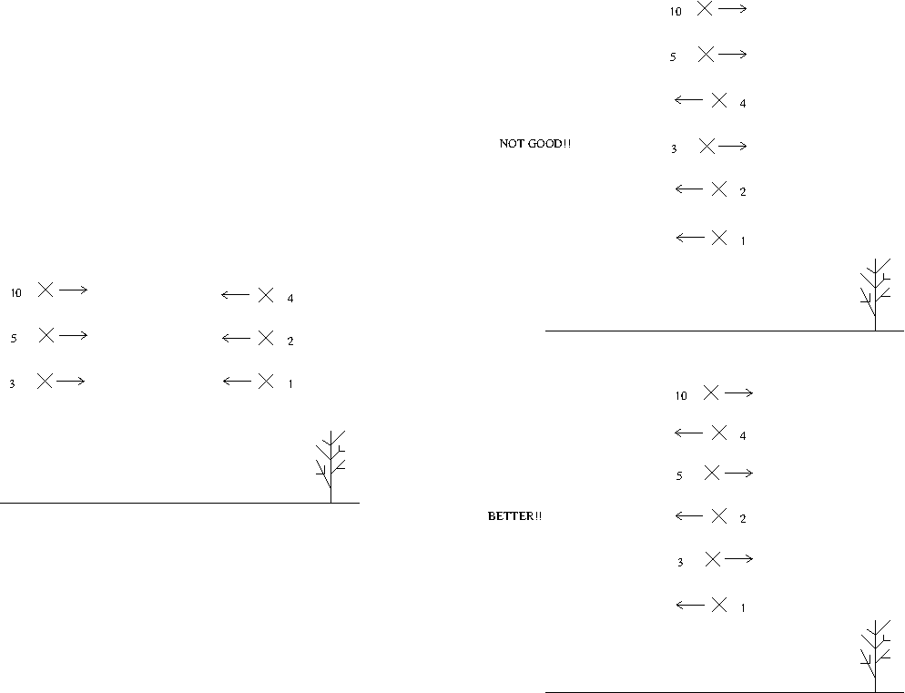
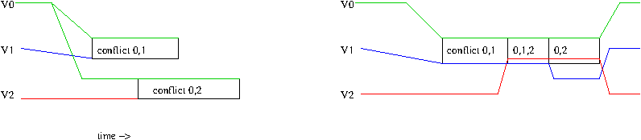

# Welcome to Joshua Send's branch of ArduPilot

The main README and documentation lives on the [summer_2017_jsend](https://github.com/flyingsilverfin/ardupilot/tree/summer_2017_jsend) branch. Here I describe my ideas for an **altitude-based n-body avoidance** algorithm.

## Concept

The main algorithmically interesting idea is to have each vehicle independently reach the same conclusion for deconfliction action. The actions I propose are altitude-based: given a set of "conflicting" vehicles in a region, each vehicle travels to a unique height and proceeds towards its goal without a deviation from the original path in XY/East-North plane. This means each vehicle is always making progress towards its goal.

The primary constraint is the use of one-directional communication: ADSB. The immediately useful information contained in these messages is ICAO (an ID), GPS position, altitude, heading, and horizontal and vertical speed. I'm doubtful that a 1 Hertz update rate will be very effective if the safety margins are not going to be very large, but this could be one aspect of experimentation as well.

My idea revolves around the concept of dynamically defining _conflict zones_ when aircraft get too close to each other. Once a conflict zone has been defined and is predicted to contain some set of vehicles, the vehicles are assigned an altitude based an ordering over their ID's. The key idea is that everyone needs compute the same set of planes to be in a conflict zone. Doing this efficiently is hard (not sure if it's even possible to do very efficiently), and its effectiveness in highly unpredictable flight patterns is doubtful, but I think there are some interesting problems buried here.

## Simplification - Static Conflict Zones

Rather than plunging straight into the dynamic collision zone definition, I think it would be fruitful and more feasibly to start with a simpler concept of zones: overlay a grid based on GPS coordinates of some regular area over the world (or some subregion to start with). Using the simple straight-line projections already found in Ardupilot, a plane predicts which other planes will enter the zone of interest. Some will likely need to be ignored as they're just leaving the zone as we enter. Given this set, assign an altitude to each plane to fly through that zone.

This high level view is obviously hiding some dangers. Importantly, planes just across boundaries do not take each other into account. However, the frequency of this occuring and causing issues might be too small to worry about.

One issue with altitude-based deconfliction is that planes have limited attainable altitudes within a forward distance constraint (ie. going too far forward would cause a collision). With multicopters this is less of an issue as they can vertically climb to their needed altitude. However, this might be something to consider if extending to fixed wing planes.

One interesting aspect of this is that if we can compute the 4 or 8 neighboring zones' and therefore what height planes are predicted to arrive at in a zone, we can merge sets of planes that are currently actively deconflicting with each other. This is much better than requiring a complete reshuffle of all the planes entering a zone based on their ID's. Imagine two columns of aircraft actively deconflicting and therefore restricted to a certain height per plane. When meeting another column in the same configuration, pairs of aircraft would crash into each other. Rather than reshuffling and starting from 'scratch', we can deconflict the planes at the same height, then insert the result into the large new column. This minimizes each plane's altitude changes. See the image below:

The prior zone's plane height could just be taken as the plane height right before entering a new zone.

The tricky bit here, as with dynamic conflict zones, is making everyone compute the same set of planes for each zone. 

Further difficulties:
* Transitions probably take some distance to achieve - transition regions between zones? Or just make zones larger and use edges to reach needed height (pretty much equivalent). Or just don't worry about it?

## Independent Computation of Sets

As mentioned before, a core difficulty is computing the same sets of vehicles in a 'zone' (static or dynamic) without bi-communication between vehicles.

Assuming we can run the same algorithm on each aircraft, and each aircraft has access to the same information at any given time, the algorithm should always compute the same set regardless of the host vehicle. Realistically, the local aircraft has access to much more information about its own position, state, intent than it does about other vehicles. However, utilizing this means the algorithm gets different information on different UAVs and thus guarantee of equivalent results is broken. Unless it can be shown that we can converge to identical results with more local information than about other vehicles, the simple solution is to restrict local information to the same as what has been sent to everyone else. Immediate receipt of ADSB messages is an approximately valid assumption as they travel as radio waves (this leads to further challenges: how to deal with _collisions_ or dropped packets? the events aren't universally known information...)

This is something I've implemented in [UAV_Avoidance.cpp](libraries/AP_Avoidance/UAV_Avoidance.cpp) along with modifications in various other parts of the firmware (If I remember correctly it was mostly [AP_ADSB](libraries/AP_ADSB) and [AP_Avoidance](/libraries/AP_Avoidance).

## Dynamic Conflict Zones

Rather than using a geographical grid defined over the earth, we can dynamically create conflict zones. My approach comes at quite a cost in computation and complexity. I continue using the assumption that we limit information

The core idea is for each plane to predict time-to-danger (ie. time until entering a certain radius) for each other plane within some distance, along with time-until-safe ie. when the overlap has passed. This computation is done in the XY plane ignoring altitude for now. This results in a time interval for each plane to each other plane (t1,t2). These intervals are then merged with other intervals for each plane, resulting in smaller intervals of a larger number of aircraft. After a while each aircraft determines all the time intervals with sets of aircraft close together. The time interval in essence defines the conflict zone. I've attempted to start implementing this in the `UAV_Avoidance` code linked above.

We can attempt to do this more efficiently by taking our local predicted flight path, and calculating relevant intervals for each other plane. These are merged and 'linearized' (see image below - right hand size if after the merging/linearization).

This would have to be done recursively to take into account any other vehicles that `v1` and `v2` conflict with other than `v0` (not depicted).

This recursive process is implicity taking advantage of transitivity of conflicts. This might be overly restrictive in the future: three planes flying in parallel, just inside of each other's alert radius (let's call them `v0`, `v1`, and `v2`). v1 is in the middle, and sees both `v0` and `v2` as conflicting. Thus, it needs to deconflict with both. However, the other two vehicles really only conflict with `v1`. We need to respect transitivity because the ID's might dictate that doing pairwise deconfliction between `v0` and `v1` results in `v1` over `v0`, while between `v1` and `v2`, `v1` is on the bottom. Thus pairwise deconfliction results in the demand that `v1` be both on top and bottom, which is impossible. Respecting a transitive conflict is one way to guarantee this doesn't happen. The transitivity propert also means that starting from the perspective of `v0` or `v1` means everyone computes the correct set of intervals for themselves (I think).

Issues:
* the interval merging process is hard to implement and think about in the recursive case
* The result of two merging intervals may result in a small time interval - small enough that we can't possibly get to the required height. Ignore it? but the result of many of these 'trimmings' might be overall quite a lot. However I think this might be the only/correct way of doing it - imagine N vehicles on a circle converging towards each other. They overlap in sets to start with then all together - we need to be most concerned about the huge confliction in the middle not the 0.5s conflict between two neighbors before and after that.

### Extensions

I can think of several extensions to this

* examine feasibly of using this approach for fixed wing planes, given their limited climb angles
* combine this with horizontal deconfliction methods as well: we could apply vertical deconfliction plus horizontal deconfliction to reduce the altitudes needed for avoidance.
* explore impact of ADSB update rate (what about heterogenous rates?)
* heterogenous aircraft safety radii?

# ArduPilot Project  (original README below)

## The ArduPilot project is made up of: ##

- ArduCopter (or APM:Copter) : [code](https://github.com/ArduPilot/ardupilot/tree/master/ArduCopter), [wiki](http://ardupilot.org/copter/index.html)

- ArduPlane (or APM:Plane) : [code](https://github.com/ArduPilot/ardupilot/tree/master/ArduPlane), [wiki](http://ardupilot.org/plane/index.html)

- ArduRover (or APMrover2) : [code](https://github.com/ArduPilot/ardupilot/tree/master/APMrover2), [wiki](http://ardupilot.org/rover/index.html)

- ArduSub (or APM:Sub) : [code](https://github.com/ArduPilot/ardupilot/tree/master/ArduSub), [wiki](http://ardusub.com/)

- Antenna Tracker : [code](https://github.com/ArduPilot/ardupilot/tree/master/AntennaTracker), [wiki](http://ardupilot.org/antennatracker/index.html)

## User Support & Discussion Forums ##

- Support Forum: <http://discuss.ardupilot.org/>

- Community Site: <http://ardupilot.org>

## Developer Information ##

- Github repository: <https://github.com/ArduPilot/ardupilot>

- Main developer wiki: <http://dev.ardupilot.org>

- Developer discussion: <http://discuss.ardupilot.org>

- Developer email group: drones-discuss@googlegroups.com. Deprecated November 2016. Included for historical reference.

## Contributors ##

- [Github statistics](https://github.com/ArduPilot/ardupilot/graphs/contributors)

## How To Get Involved ##

- The ArduPilot project is open source and we encourage participation and code contributions: [guidelines for contributors to the ardupilot codebase](http://dev.ardupilot.org/wiki/guidelines-for-contributors-to-the-apm-codebase)

- We have an active group of Beta Testers especially for ArduCopter to help us find bugs: [release procedures](http://dev.ardupilot.org/wiki/release-procedures)

- Desired Enhancements and Bugs can be posted to the [issues list](https://github.com/ArduPilot/ardupilot/issues).

- Helping other users with log analysis on [http://discuss.ardupilot.org/](http://discuss.ardupilot.org/) is always appreciated:

- There is a group of wiki editors as well in case documentation is your thing: <ardu-wiki-editors@googlegroups.com>

- Developer discussions occur on <drones-discuss@google-groups.com>

## License ##

The ArduPilot project is licensed under the GNU General Public
License, version 3.

- [Overview of license](http://dev.ardupilot.com/wiki/license-gplv3)

- [Full Text](https://github.com/ArduPilot/ardupilot/blob/master/COPYING.txt)

## Maintainers ##

Ardupilot is comprised of several parts, vehicles and boards. The list below
contains the people that regularly contribute to the project and are responsible
for reviewing patches on their specific area. See [CONTRIBUTING.md](.github/CONTRIBUTING.md) for more information.

- [Andrew Tridgell](https://github.com/tridge)
  - ***Vehicle***: Plane, AntennaTracker
  - ***Board***: APM1, APM2, Pixhawk, Pixhawk2, PixRacer
- [Randy Mackay](https://github.com/rmackay9)
  - ***Vehicle***: Copter, AntennaTracker
- [Robert Lefebvre](https://github.com/R-Lefebvre)
  - ***Vehicle***: TradHeli
- [Grant Morphett](https://github.com/gmorph):
  - ***Vehicle***: Rover
- [Tom Pittenger](https://github.com/magicrub)
  - ***Vehicle***: Plane
- [Paul Riseborough](https://github.com/priseborough)
  - ***Subsystem***: AP_NavEKF2
  - ***Subsystem***: AP_NavEKF3
- [Lucas De Marchi](https://github.com/lucasdemarchi)
  - ***Subsystem***: Linux
- [Peter Barker](https://github.com/peterbarker)
  - ***Subsystem***: DataFlash
  - ***Subsystem***: Tools
- [Michael du Breuil](https://github.com/WickedShell)
  - ***Subsystem***: SMBus Batteries
  - ***Subsystem***: GPS
- [Francisco Ferreira](https://github.com/oxinarf)
  - ***Bug Master***
- [Matthias Badaire](https://github.com/badzz)
  - ***Subsystem***: FRSky
- [Eugene Shamaev](https://github.com/EShamaev)
  - ***Subsystem***: CAN bus
  - ***Subsystem***: UAVCAN
- [Víctor Mayoral Vilches](https://github.com/vmayoral)
  - ***Board***: PXF, Erle-Brain 2, PXFmini
- [Mirko Denecke](https://github.com/mirkix)
  - ***Board***: BBBmini, BeagleBone Blue
- [Georgii Staroselskii](https://github.com/staroselskii)
  - ***Board***: NavIO
- [Emile Castelnuovo](https://github.com/emilecastelnuovo)
  - ***Board***: VRBrain
- [Julien BERAUD](https://github.com/jberaud)
  - ***Board***: Bebop & Bebop 2
- [Pritam Ghanghas](https://github.com/pritamghanghas)
  - ***Board***: Raspilot
- [Matt Lawrence](https://github.com/Pedals2Paddles)
  - ***Vehicle***: 3DR Solo & Solo based vehicles
- [Gustavo José de Sousa](https://github.com/guludo)
  - ***Subsystem***: Build system
- [Craig Elder](https://github.com/CraigElder)
  - ***Administration***: ArduPilot Technical Community Manager
- [Jacob Walser](https://github.com/jaxxzer)
  - ***Vehicle***: Sub
