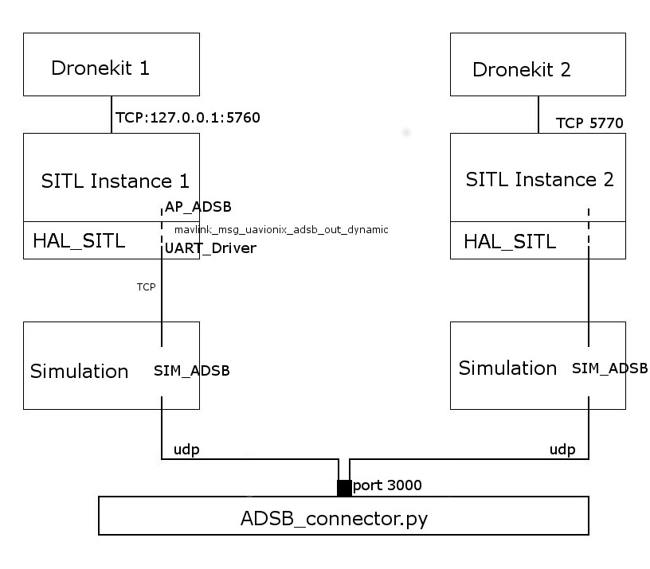

# Welcome to Joshua Send's branch of ArduPilot

This fork was created in the latter half of my internship in Cambridge under Cecilia Mascalo and Alessandro Montenari.

A large part of the work was creating a framework for evaluating the existing collision avoidance built into ArduPilot. This involved implementing functionality for multiple instances of software-in-the-loop (SITL) simulated multicopters to talk to each other over the ADS-B protocol (see [Motivation] (#motivation)). Various python scrips generate flight paths, launch SITL instances, and evaluate the resulting flight logs.

In the last week of my internship I had an idea for an n-body collision avoidance algorithm which I started outlining and implementing, though probably needs to be thought through again any further work is done.

The rest of this document outlines background information, an intuition for Ardupilot and related UAV-technologies (some of which took me a long time to find and learn), the evaluation framework I built, and an outline of my N-Body avoidance idea.

## Background

### Motivation 
The initial idea of the internship was to do research into air traffic control for urban environments. Air traffic control is composed of multiple elements ranging from path planning, air restrictions, plane identification, collision avoidance, weather planning and more. The next generation of air traffic control systems will be similar to the proposed/in progress system in the US called [NextGen](https://en.wikipedia.org/wiki/Next_Generation_Air_Transportation_System).

[This paper](http://unmanned.berkeley.edu/assets/papers/Aislan_REDUAS15.pdf) is a decent introduction to many of the issues around modern air traffic control. One key element is the massive increase is airborne vehicles, due to UAV use, which exceeds the capacity of the current human air traffic control operators. Automated, dynamic airspace management is the next step. [AirMap](https://www.airmap.com/) appears to be working towards this as a package licenseable to states/cities.

It was eventually settled I would work on collision avoidance as it is a rather self-contained problem it might be possible to do some research in. However, this is a classic robotics problem that has seen a recent (~last decade) explosion of research due to autonomy in cars, factories, and UAVs. A selection of papers I find enlightening and interesting are listed in the next section.

One important takeaway from all this is the standardization of [ADS-B](https://en.wikipedia.org/wiki/Automatic_dependent_surveillance_%E2%80%93_broadcast) as a replacement for radar in NextGen which broadcasts position, heading, speed, callsign. There's a good chance something like this will become standard in smaller vehicles as well, so my work focused on using ADS-B driven collision avoidance. ADSB equipped planes tend to use a 1Hz broadcast rate with a range of 500+ miles.

### Past work

Here's just a brief introduction to some of the background reading I found

* Two papers from 1997 with some basic but interesting ideas [here](http://citeseerx.ist.psu.edu/viewdoc/download?doi=10.1.1.533.7928&rep=rep1&type=pdf) and [here](http://ieeexplore.ieee.org/stamp/stamp.jsp?arnumber=657844)
* [This Paper](https://link.springer.com/article/10.1007/s10514-013-9334-3) from 2013
  * It uses something called an RRT or rapidly exploring random tree
  * The paper developing this is somewhat older but the core features are widely used
  * I figure these are a bit too expensive to do on a small flight controller, but are perhaps feasible soon
* Speaking of RRTs, a 2015 paper combined ADSB and RRTs for collision avoidance: [here](https://asu.pure.elsevier.com/en/publications/sense-and-avoid-for-unmanned-aerial-vehicles-using-ads-b-2)
  * This approach could be improved; it's aimed at avoiding large aircraft, uses RRT's which I think are relatively expensive, only avoids 1 aircraft at a time, and doesn't specify how to return towards the original goal

There are many more papers in this field. Thorough overviews can be found in suveys. A recent one is [this 2015 one](http://www.sciencedirect.com/science/article/pii/S0376042115000020) which does a good job categorizing approaches, which range from force-field, to genetic, to game theoretic, to control theory. [This other one](https://link.springer.com/chapter/10.1007%2F978-3-319-17765-6_18) is less expansive but focuses more on collision avoidance rather than path planning. Quick note: path planning can solve collision avoidance, but collision avoidance can be reactive and only deviate when sensing an obstacle (*sense and avoid*). We also want to think about approaches that are decentralized, as we only have one way communication via ADS-B and can't perform concensus or coordinated decision making.

### Project

As a result of all the existing work, it's hard for newcomers to try to invent something original - I decided to evaluate the existing collision avoidance in ArduPilot. Just as I mostly finished the framework for this (see [Framework](#framework)), I came up with what I think is a novel idea I outline at the end of this document.


## Evaluation 

There are several simulators that can be used for evaluating algorithms. I began with [AirSim](https://github.com/Microsoft/AirSim/) but this is focused on vision and machine learning, and doesn't have any functionality for ADS-B or multiple drones. I ended up using ArduPilot which has a great community and is quite mature.

However, it is quite a large platform so hopefully the next section will give useful pointers and help the familiarization process.

### Familiarization with Ardupilot

[This](http://ardupilot.org/) is the Ardupilot homepage but more useful is the [dev wiki](http://ardupilot.org/dev/index.html).

Ardupilot is a firmware that can control copters, planes, rovers, subs and more. In the source, code specific to each of these is under `ArduCopter/`, `ArduPlane/` etc. Shared code for multiple platforms is in `libraries/`. I use ArduCopter as my main target to start with, though some of the ideas might be transferable to Plane.

#### Components 

There are several components which enable simulated drone flights. A build of the ArduPilot for `SITL` (software-in-the-loop) produces the binary for the physics and copter simulation. Normally, an instance can then be started and communicated with using a `MavProxy` instance, which is a *Ground Control Station* capable of controlling the UAV over some sort of communication link. The communication link runs a protocol called `MAVLink` (in fact, basically all communication to do with UAVs will be MAVlink including on the drone itself). Python scripts communicating with a drone can use a python wrapper for `mavlink` called `pymavlink`. A even higher level library called `DroneKit` provides a nice API for simple movement commands - I use this as a pretend onboard computer (which might be a raspberry pi) which communicates with the drone and tells it what to do - for instance go to the next waypoint.

#### Build ArduPilot SITL
You don't actually need to do this manually, there's a script `Tools/autotest/sim_vehicle.py` which will do the build and all that for you. However, I like to split the commands `sim_vehicle` runs internally (ie. an instance of SITL and an instance of MAVProxy as a ground station) so I can say run the SITL instance within `gdb` for debugging purposes.

Start page is [here](http://ardupilot.org/dev/docs/building-the-code.html), and for SITL is [here](http://ardupilot.org/dev/docs/setting-up-sitl-on-linux.html). I used BashOnWindows which is more or less equivalent to linux for my purposes - use an X server like XMing to run the graphical interfaces if needed on windows.

The key steps that need to be run after cloning the repository are
1. The prerequisites script `Tools/scripts/install-prereqs-ubuntu.sh`
    * this sets ups various required tools, initializes git submodules (for instance pymavlink) and some other stuff
1. `waf configure --board sitl --debug`
    * run this from the ArduPilot root director.y `waf` is the build platform used by ArduPilot. Don't use `make` - it's deprecated. This step sets up the build to compile the SITL target in debug mode (see (Debuging)[#debugging]), which lets you use gdb to debug later if you want. Very useful sometimes I've found!
1. `waf build --target bin/arducopter -v -j8 --debug`
    * This bulds the `arducopter` binary in verbose mode using up to 8 threads. The resulting binary should be under `build/sitl-debug/bin/arducopter`


#### Running SITL firmware with debugging 
I've found this really useful! Run `gdb` with the `sitl-debug` binary like this:

```
gdb --args ~/dev/ardupilot/build/sitl-debug/bin/arducopter -S -I1 --home -35.663261,149
.165230,584,353 --model + --speedup 1 --defaults ~/dev/ardupilot/tests/avoidance_evaluation/copter_parameters/copter_params_1.parm --wipe
```

This launches gdb with the rest of the parameters as the command to run. When `run` is executed in gdb, we get the SITL instance running as instance `1`, at the given GPS coordinates, altitude (meters), and heading (degrees from true North). The `model +` tells it to use a quadcopter frame, run with speedup 1 (ie. no speedup), and default parameters given. `--wipe` will wipe any stored parameters and state and use the defaults provided with the new instance.

#### MAVProxy 
Just running the binary as above won't do anything, it's waiting for a ground station to connect to it - ie. MAVProxy. After installing mavproxy, if it isn't already installed (try `sudo pip install MAVProxy`), run:

`mavproxy.py --master tcp:127.0.0.1:5770 --out udp:127.0.0.1:3005 --map --console`
* `--master` tells it the TCP port that the SITL instance is expecting it's communications link on. Note that we're connecting to `I1` or instance, one which is at port `1*10 + 5760`. Instance 0 would be at 5760.
* `--out` tells mavproxy to open an extra UDP port to 3005 to which it forwards all mavlink packets it receives (this is quite a lot).
* `--map` and `--console` launch two graphical interfaces for the drone

Check mavproxy documentation for further details.

Try a basic flight:
1. `mode guided`
1. `arm throttle` (this has a timeout and will disarm if not quick enough on the takeoff)
1. `takeoff 10` (takeoff 10m)
1. right click on the map and click `fly to` 
1. `mode land` should slowly descent and land, while `mode rtl` should return to home position and land

#### Parameters
In MAVProxy you can also also adjust a lot of parameters that affect the flight or simulation. List them all with `param show *` or some other regexp. There can be set here, as well as in the default parameters file provided to the binary.

**Modifying SYSID_THISMAV** which is the system ID for the drone and needs to be unique requires a restart of the instance! I didn't realize this for a while which is why there are many parameter files under `tests/avoidance_evaluation/copter_parameters` only differing by the ID.

The other parameters I set in those files relate to enabling ADSB simulation, as well as enabling the built in obstacle avoidance. The main file is `copter_params.parm` which, upon running the `generate_params.py` script in the folder copies it with correct id's.


#### Summary ####

Cool! Everything above is related to general Ardupilot, SITL, Mavproxy stuff. Next up is modifications and scripts I've written. More documentation in the code itself.

### Framework

The firmware ships with a bit of code which generates fake 'flights' for testing ADSB avoidance - but these aren't other simulated copters or planes that act independently. See [here](http://ardupilot.org/copter/docs/common-ads-b-receiver.html)

#### Overview ####

NOTE: this portion my work is on the **summer_2017_jsend** branch of this fork! Ie. if you're seeing this, you're good!

The first step is to let multiple actual SITL instances talk to each other over ADS-B. The architecture I ended up with is in the image below:



Dronekit instances (Python) control each simulated copter. This includes controlling takeoff, waypoints, speed etc. The firmware running is agnostic to the platform (could be Pixhawk, native linux etc.). To enable this, the HAL (hardware abstraction layer) we built here is called HAL_SITL, a specific abstraction layer for software in the loop simulations. One relevant aspect of this is that the `UART_Driver` component knows to connect to a Socket rather than an actual hardware device. The other end of this socket ends up in the simulation portion, specifically connected to `SIM_ADSB`. I've modified `SIM_ADSB` to better model an actual ADSB transceiver, and it now forwards `mavlink_msg_adsb_vehicle` messages to a python script `ADSB_connector.py`. For comparision, in real flights messages travel from the proprietary UAVIONIX transceiver over the air to other receivers, arriving back in `AP_ADSB` as `mavlink_msg_adsb_vehicle`. The python script passes these messages back to all other simulations running at the time. By routing through an external script we could easily incorporate packet loss rates (skip forwarding sometimes), and out of range functionality (don't forward if gps coordinates are too far apart).

The parameter settings that SITL instances are loaded with means that a `logs` directory should be found, with one folder per experiment and within that one directory per instance. The resulting position logs are analyzed by a separate script.

If you want to delve into the ArduPilot source, here's a list of relevant locations:
* [libraries/AP_ADSB](libraries/AP_ADSB)
* [libraries/AP_Avoidance](libraries/AP_Avoidance)
* [libraries/SITL](libraries/SITL)  Notably the SIM_ADSB files in there
* [libraries/AP_HAL_SITL](libraries/AP_HAL_SITL) The UARTDriver here is one part of the abstraction. Rather than trying to dive through all of this manually as I did once I recommend using `gdb` to attach a breakpoint somewhere and checking the stack trace.

### Experiment Creation, Running, and analysis

These scripts are located under [tests/avoidance_evaluation](tests/avoidance_evaluation). 

See the README there for more details!

The intended usage is: 
1. generate experiment(s)
2. run experiments
3. analyze logs


### Existing Collision Avoidance 

I realized at one point that the existing collision avoidance built into `AP_Avoidance` is a *failsafe*. In other words, it takes over complete control if it detects danger (configurable via the parameters `AVD_*` - to access most of these you may need to set `AVD_ENABLE` to `1`, and then run `param fetch`).

The end result is that you cannot make progress toward your goal or retain control while the failsafe has kicked in. The failsafe behavior is settable via a parameter, ranging from landing to flying away perpendicularly from the incoming object's flight path. 

I believe this approach is great for avoiding manned aircraft - in the interest of minimizing risk to humans, the best thing to do is run away from the incoming aircraft. However, this is too restrictive for drone-drone interactions and continue to make progress toward our goal while also avoiding other vehicles. My new idea for achieving this is discussed in the next section.

The failsafe built into ArduPlot essentially does a straight line projection of the current vehicle and up to N other vehicles it tracks via their ADSB messages. A forward projection up to a time horizon predicts the closest a vehicle comes. The most imminent threat is then taken action against if it is predicted to approach within some radius. This highly effective approach in avoiding conflict can largely be analyzed analytically; it can really only be beaten if given a relative velocity *v*, with an adsb update period of *t* and avoidance radius of *r*, _v*t > r_.

As a result of these realizations I spent my last week considering an N-Body avoidance algorithm developed further below.

## N-Body Avoidance idea 
Switch to the branch **summer_2017_jsend_deconfliction** and see the readme there!


# ArduPilot Project  (original README below)

[](https://gitter.im/ArduPilot/ardupilot?utm_source=badge&utm_medium=badge&utm_campaign=pr-badge&utm_content=badge)

[](https://semaphoreci.com/diydrones/ardupilot)

[](https://travis-ci.org/ArduPilot/ardupilot)

[](https://scan.coverity.com/projects/diydrones-ardupilot)

## The ArduPilot project is made up of: ##

- ArduCopter (or APM:Copter) : [code](https://github.com/ArduPilot/ardupilot/tree/master/ArduCopter), [wiki](http://ardupilot.org/copter/index.html)

- ArduPlane (or APM:Plane) : [code](https://github.com/ArduPilot/ardupilot/tree/master/ArduPlane), [wiki](http://ardupilot.org/plane/index.html)

- ArduRover (or APMrover2) : [code](https://github.com/ArduPilot/ardupilot/tree/master/APMrover2), [wiki](http://ardupilot.org/rover/index.html)

- ArduSub (or APM:Sub) : [code](https://github.com/ArduPilot/ardupilot/tree/master/ArduSub), [wiki](http://ardusub.com/)

- Antenna Tracker : [code](https://github.com/ArduPilot/ardupilot/tree/master/AntennaTracker), [wiki](http://ardupilot.org/antennatracker/index.html)

## User Support & Discussion Forums ##

- Support Forum: <http://discuss.ardupilot.org/>

- Community Site: <http://ardupilot.org>

## Developer Information ##

- Github repository: <https://github.com/ArduPilot/ardupilot>

- Main developer wiki: <http://dev.ardupilot.org>

- Developer discussion: <http://discuss.ardupilot.org>

- Developer email group: drones-discuss@googlegroups.com. Deprecated November 2016. Included for historical reference.

## Contributors ##

- [Github statistics](https://github.com/ArduPilot/ardupilot/graphs/contributors)

## How To Get Involved ##

- The ArduPilot project is open source and we encourage participation and code contributions: [guidelines for contributors to the ardupilot codebase](http://dev.ardupilot.org/wiki/guidelines-for-contributors-to-the-apm-codebase)

- We have an active group of Beta Testers especially for ArduCopter to help us find bugs: [release procedures](http://dev.ardupilot.org/wiki/release-procedures)

- Desired Enhancements and Bugs can be posted to the [issues list](https://github.com/ArduPilot/ardupilot/issues).

- Helping other users with log analysis on [http://discuss.ardupilot.org/](http://discuss.ardupilot.org/) is always appreciated:

- There is a group of wiki editors as well in case documentation is your thing: <ardu-wiki-editors@googlegroups.com>

- Developer discussions occur on <drones-discuss@google-groups.com>

## License ##

The ArduPilot project is licensed under the GNU General Public
License, version 3.

- [Overview of license](http://dev.ardupilot.com/wiki/license-gplv3)

- [Full Text](https://github.com/ArduPilot/ardupilot/blob/master/COPYING.txt)

## Maintainers ##

Ardupilot is comprised of several parts, vehicles and boards. The list below
contains the people that regularly contribute to the project and are responsible
for reviewing patches on their specific area. See [CONTRIBUTING.md](.github/CONTRIBUTING.md) for more information.

- [Andrew Tridgell](https://github.com/tridge)
  - ***Vehicle***: Plane, AntennaTracker
  - ***Board***: APM1, APM2, Pixhawk, Pixhawk2, PixRacer
- [Randy Mackay](https://github.com/rmackay9)
  - ***Vehicle***: Copter, AntennaTracker
- [Robert Lefebvre](https://github.com/R-Lefebvre)
  - ***Vehicle***: TradHeli
- [Grant Morphett](https://github.com/gmorph):
  - ***Vehicle***: Rover
- [Tom Pittenger](https://github.com/magicrub)
  - ***Vehicle***: Plane
- [Paul Riseborough](https://github.com/priseborough)
  - ***Subsystem***: AP_NavEKF2
  - ***Subsystem***: AP_NavEKF3
- [Lucas De Marchi](https://github.com/lucasdemarchi)
  - ***Subsystem***: Linux
- [Peter Barker](https://github.com/peterbarker)
  - ***Subsystem***: DataFlash
  - ***Subsystem***: Tools
- [Michael du Breuil](https://github.com/WickedShell)
  - ***Subsystem***: SMBus Batteries
  - ***Subsystem***: GPS
- [Francisco Ferreira](https://github.com/oxinarf)
  - ***Bug Master***
- [Matthias Badaire](https://github.com/badzz)
  - ***Subsystem***: FRSky
- [Eugene Shamaev](https://github.com/EShamaev)
  - ***Subsystem***: CAN bus
  - ***Subsystem***: UAVCAN
- [Víctor Mayoral Vilches](https://github.com/vmayoral)
  - ***Board***: PXF, Erle-Brain 2, PXFmini
- [Mirko Denecke](https://github.com/mirkix)
  - ***Board***: BBBmini, BeagleBone Blue
- [Georgii Staroselskii](https://github.com/staroselskii)
  - ***Board***: NavIO
- [Emile Castelnuovo](https://github.com/emilecastelnuovo)
  - ***Board***: VRBrain
- [Julien BERAUD](https://github.com/jberaud)
  - ***Board***: Bebop & Bebop 2
- [Pritam Ghanghas](https://github.com/pritamghanghas)
  - ***Board***: Raspilot
- [Matt Lawrence](https://github.com/Pedals2Paddles)
  - ***Vehicle***: 3DR Solo & Solo based vehicles
- [Gustavo José de Sousa](https://github.com/guludo)
  - ***Subsystem***: Build system
- [Craig Elder](https://github.com/CraigElder)
  - ***Administration***: ArduPilot Technical Community Manager
- [Jacob Walser](https://github.com/jaxxzer)
  - ***Vehicle***: Sub
